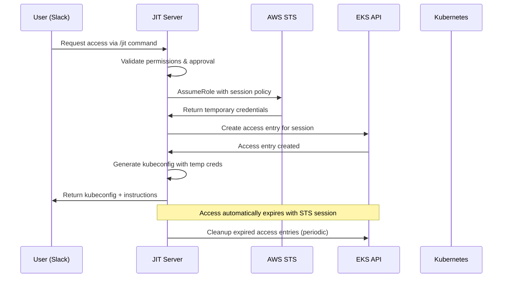

# JIT Access Architecture for EKS with IAM Access Entries

## Overview

This document outlines the recommended architecture for providing Just-In-Time (JIT) access to EKS clusters using IAM access entries, temporary credentials, and automated cleanup.

## Architecture Components

### 1. IAM Role Strategy

#### JIT Access Role
```
arn:aws:iam::ACCOUNT:role/JITAccessRole
```

**Trust Policy:**
- Trust the JIT service's execution role
- Include condition keys for additional security

**Permissions:**
- `eks:DescribeCluster`
- `eks:ListClusters` 
- `eks:AccessKubernetesApi`
- `eks:CreateAccessEntry`
- `eks:DeleteAccessEntry`
- `eks:AssociateAccessPolicy`

#### User-Specific Temporary Sessions
- Created via STS AssumeRole with session policies
- Limited duration (1-8 hours max)
- Unique session names for tracking
- Tagged for audit purposes

### 2. EKS Access Entry Management

#### Temporary Access Entries
- Created dynamically per request
- Principal ARN points to temporary STS session
- Scoped to specific namespaces when possible
- Automatically tagged for identification

#### Access Policies
- **Viewer**: `AmazonEKSViewPolicy` - Read-only access
- **Editor**: `AmazonEKSEditPolicy` - Standard CRUD operations  
- **Admin**: `AmazonEKSClusterAdminPolicy` - Full cluster access

### 3. Access Flow



## Implementation Details

### 1. Temporary Credential Generation

```go
// Generate time-limited credentials with restricted permissions
creds, err := stsService.AssumeRole(ctx, AssumeRoleInput{
    RoleArn:         "arn:aws:iam::ACCOUNT:role/JITAccessRole",
    SessionName:     "jit-user123-cluster456-20240610-143022",
    DurationSeconds: 3600, // 1 hour
    Policy:          restrictiveSessionPolicy,
    Tags: []Tag{
        {Key: "Purpose", Value: "JITAccess"},
        {Key: "UserID", Value: "user123"},
        {Key: "ClusterID", Value: "cluster456"},
    },
})
```

### 2. EKS Access Entry Creation

```go
// Create temporary access entry for the STS session
err := eksService.CreateAccessEntry(ctx, AccessEntry{
    ClusterName:  "my-cluster",
    PrincipalArn: "arn:aws:sts::ACCOUNT:assumed-role/JITAccessRole/jit-session",
    Username:     "jit:user123",
    AccessPolicies: []AccessPolicy{
        {
            PolicyArn: "arn:aws:eks::aws:cluster-access-policy/AmazonEKSViewPolicy",
            AccessScope: AccessScope{
                Type:       "namespace",
                Namespaces: []string{"development", "staging"},
            },
        },
    },
})
```

### 3. Kubeconfig Generation

```yaml
apiVersion: v1
kind: Config
clusters:
- cluster:
    certificate-authority-data: LS0t...
    server: https://ABC123.gr7.us-east-1.eks.amazonaws.com
  name: my-cluster
contexts:
- context:
    cluster: my-cluster
    user: jit-user
  name: my-cluster
current-context: my-cluster
users:
- name: jit-user
  user:
    exec:
      apiVersion: client.authentication.k8s.io/v1beta1
      command: aws
      args:
        - eks
        - get-token
        - --cluster-name
        - my-cluster
        - --region
        - us-east-1
      env:
        - name: AWS_ACCESS_KEY_ID
          value: ASIATEMP...
        - name: AWS_SECRET_ACCESS_KEY
          value: temp-secret
        - name: AWS_SESSION_TOKEN
          value: temp-session-token
```

## Security Considerations

### 1. Principle of Least Privilege
- Session policies restrict permissions further than the base role
- Namespace-scoped access when possible
- Time-limited sessions (max 8 hours)

### 2. Audit Trail
- All access logged with request IDs
- STS sessions tagged with user context
- CloudTrail captures all API calls

### 3. Automatic Cleanup
- STS sessions expire automatically
- Periodic cleanup of orphaned access entries
- Failed request cleanup

## Operational Procedures

### 1. Access Request Flow
1. User requests access via Slack command
2. System validates user permissions
3. Approval workflow (if required)
4. Temporary credentials generated
5. EKS access entry created
6. Kubeconfig provided to user
7. Access expires automatically

### 2. Emergency Revocation
```bash
# Revoke specific access
/jit admin revoke --request-id abc123

# Emergency cluster lockdown
/jit admin lockdown --cluster production
```

### 3. Monitoring & Alerts
- Failed access attempts
- Long-running sessions
- Unusual permission requests
- Access pattern anomalies

## Configuration

### Required IAM Policies

#### JIT Service Role
```json
{
  "Version": "2012-10-17",
  "Statement": [
    {
      "Effect": "Allow",
      "Action": [
        "sts:AssumeRole",
        "sts:TagSession"
      ],
      "Resource": "arn:aws:iam::*:role/JITAccessRole"
    },
    {
      "Effect": "Allow", 
      "Action": [
        "eks:CreateAccessEntry",
        "eks:DeleteAccessEntry",
        "eks:DescribeAccessEntry",
        "eks:ListAccessEntries",
        "eks:AssociateAccessPolicy",
        "eks:DescribeCluster"
      ],
      "Resource": "*"
    }
  ]
}
```

#### JIT Access Role Trust Policy
```json
{
  "Version": "2012-10-17",
  "Statement": [
    {
      "Effect": "Allow",
      "Principal": {
        "AWS": "arn:aws:iam::ACCOUNT:role/JITServiceRole"
      },
      "Action": "sts:AssumeRole",
      "Condition": {
        "StringEquals": {
          "sts:RequestedRegion": ["us-east-1", "us-west-2"]
        },
        "StringLike": {
          "sts:RoleSessionName": "jit-*"
        }
      }
    }
  ]
}
```

## Benefits

1. **Zero Standing Access**: No permanent cluster access
2. **Automatic Expiration**: Credentials expire without manual intervention
3. **Granular Permissions**: Namespace and action-level scoping
4. **Full Audit Trail**: Every access request tracked and logged
5. **Emergency Controls**: Rapid revocation capabilities
6. **Compliance Ready**: Meets SOC2, HIPAA, PCI requirements

## Limitations

1. **Setup Complexity**: Requires careful IAM configuration
2. **AWS Dependencies**: Tightly coupled to AWS services
3. **Network Requirements**: Requires connectivity to AWS APIs
4. **Session Limits**: Maximum 8-hour sessions (AWS limit)

This architecture provides enterprise-grade security while maintaining operational efficiency for temporary EKS access.